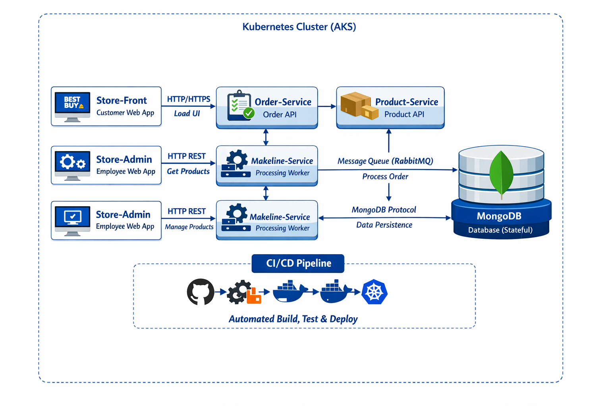

# Best Buy Microservices Demo

This repository is part of a cloud-native microservices demo for a **Best Buy Electronics Store**. It contains the **Product Service**, a REST API for managing the product catalog.

For the full demo, this service is designed to work alongside four other microservices and a MongoDB database.





[Watch the Best Buy Microservices Demo on YouTube](https://www.youtube.com/watch?v=VIDEO_ID)


## 🏗️ The Best Buy Microservices Ecosystem

This is one of five microservices that make up the application:

| Service | Language | Description | Repository | Docker Hub Image |
|---------|----------|-------------|------------|------------------|
| **Store Front** | Vue.js | Customer web app for browsing products and placing orders | [bryanedler8/store-front-L8](https://github.com/bryanedler8/store-front-L8) | `bryanedler8/store-front:latest` |
| **Store Admin** | Vue.js | Employee web app for managing products and inventory | [bryanedler8/store-admin-L8](https://github.com/bryanedler8/store-admin-L8) | `bryanedler8/store-admin:latest` |
| **Product Service** (This Repo) | Rust | API for product catalog management | [bryanedler8/product-service-L8](https://github.com/bryanedler8/product-service-L8) | `bryanedler8/product-service:latest` |
| **Order Service** | Node.js | API for order processing | [bryanedler8/order-service-L8](https://github.com/bryanedler8/order-service-L8) | `bryanedler8/order-service:latest` |
| **Makeline Service** | Go | Background worker that processes orders from a queue | [bryanedler8/makeline-service-L8](https://github.com/bryanedler8/makeline-service-L8) | `bryanedler8/makeline-service:latest` |
| **Database** | MongoDB | Stateful data store for products and orders | N/A (Official MongoDB Image) | `mongo:latest` |

## 🚀 About the Product Service

This Rust application provides a simple, in-memory REST API for a product catalog. It's designed to be lightweight and easy to run for development and testing purposes.

### Key Features

- REST API for product operations (List, Get, Create, Update, Delete)
- In-memory data store - Products are reloaded from sample data on restart
- Best Buy specific routes like `/products/category/{category}` and inventory checks
- Health check endpoint for container orchestration

### API Endpoints

| Method | Endpoint | Description |
|--------|----------|-------------|
| `GET` | `/health` | Service health check |
| `GET` | `/products` | Get a list of all products |
| `GET` | `/products/{id}` | Get a single product by its ID |
| `GET` | `/products/category/{category}` | Get products by category (e.g., Laptops, Audio) |
| `GET` | `/products/{id}/inventory` | Check the stock level of a product |
| `POST` | `/products` | Add a new product |
| `PUT` | `/products/{id}` | Update an existing product |
| `DELETE` | `/products/{id}` | Delete a product |
| `PUT` | `/products/{id}/inventory` | Update inventory (e.g., for order fulfillment) |

## 💻 Local Development

### Prerequisites

- [Rust](https://www.rust-lang.org/tools/install)

### Running the Service

1. Clone the repository:
   ```bash
   git clone https://github.com/bryanedler8/product-service-L8.git
   cd product-service-L8
🐳 Docker
Build and run the service using Docker:

bash
# Build the image
docker build -t bryanedler8/product-service:latest .

# Run the container
docker run -d -p 3002:3002 bryanedler8/product-service:latest
☸️ Kubernetes Deployment
This service is designed to be deployed on a Kubernetes cluster. A comprehensive set of manifests is available in the main project's k8s directory.

To deploy to an existing AKS cluster:

bash
# Apply the deployment and service
kubectl apply -f k8s/deployments/product-service.yaml -n bestbuy
kubectl apply -f k8s/services/product-service.yaml -n bestbuy
⚙️ CI/CD Pipeline
This repository includes a GitHub Actions workflow (.github/workflows/ci_cd.yaml) that automates:

Build & Test: Compiles the Rust code and runs tests

Release: Builds the Docker image and pushes it to Docker Hub with :test and :latest tags

Deploy: Connects to an AKS cluster (using the KUBE_CONFIG_DATA secret) and updates the deployment

Required GitHub Secrets & Variables
For the CI/CD pipeline to work, you must configure the following in your repository settings (Settings > Secrets and variables > Actions).

Variables:

Name	Value
DOCKER_IMAGE_NAME	product-service
DEPLOYMENT_NAME	product-service
CONTAINER_NAME	product-service
Secrets:

Name	Description
DOCKER_USERNAME	Your Docker Hub username (bryanedler8)
DOCKER_PASSWORD	Your Docker Hub password or a personal access token
KUBE_CONFIG_DATA	A base64-encoded kubeconfig file for your AKS cluster
📁 Project Structure
text
product-service-L8/
├── src/               # Rust source code
├── .github/workflows/ # CI/CD pipeline
├── Dockerfile         # Container definition
├── Cargo.toml         # Rust dependencies
├── config.yml         # Service configuration
└── README.md          # This file
